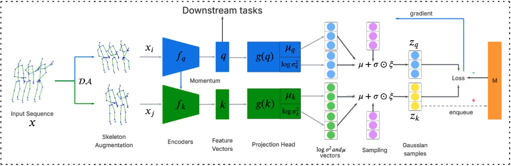
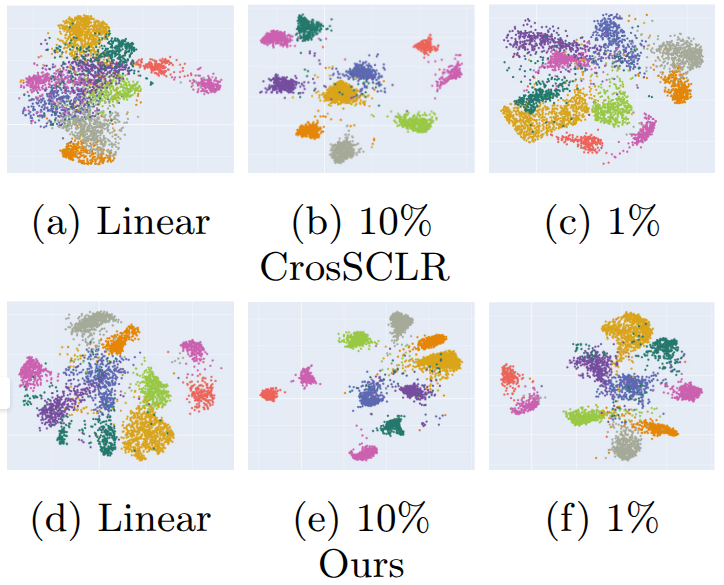

# Variational Contrastive Learning for Skeleton-based Action Recognition

The official PyTorch implementation of "Variational Contrastive Learning for Skeleton-based Action Recognition", available on [Arxiv](https://arxiv.org/abs/2601.07666).



## Requirements
    

```bash
# Install other python libraries
$ pip install -r requirements.txt
```

## Data Preparation
- Download the raw data of [NTU RGB+D](https://github.com/shahroudy/NTURGB-D) and [PKU-MMD](https://www.icst.pku.edu.cn/struct/Projects/PKUMMD.html).
- The ```run.py process``` command handles data preprocessing. It supports various modalities (Joint/Bone/Motion) and benchmarks (Cross-Subject/Cross-View).

```
$ python run.py process -h
usage: run.py process [-h] [--dataset DATASET] [--modality {joint,bone,motion}] [--benchmark {xsub,xview,xsetup}]
                      [--part {train,eval}] [--pre_transform] [--force_reload] [--summary]

options:
  -h, --help            show this help message and exit
  --dataset DATASET     path towards dataset: nturgb+d | nturgb+d_120 | pku_mmd | pku_mmd_v2
  --modality {joint,bone,motion}
                        modality: joint | bone | motion
  --benchmark {xsub,xview,xsetup}
                        benchmark: xsub | xview | xsetup
  --part {train,eval}   part: train | eval
  --pre_transform       authorize pre-transformation
  --force_reload        force processing
  --summary             summary of preprocessed dataset
```
- Enable ```--pre_transform``` to translate the original 3D location of the skeleton joints from camera coordinate system to body coordinates during processing.
- Use ```--force_reload``` if you need to overwrite existing processed files.

## Unsupervised Pre-Training

Example for unsupervised pre-training the model. You can change some settings of `.yaml` files in `config/` folder.
```bash
# train on NTU RGB+D xsub joint stream
$ python run.py pre_train --config config/ntu60_xsub_joint_pretext.yaml

# train on NTU RGB+D xsub motion stream
$ python run.py pre_train --config config/ntu60_xsub_motion_pretext.yaml

# train on NTU RGB+D xsub bone stream
$ python run.py pre_train --config config/ntu60_xsub_bone_pretext.yaml
```

The configs and pre-trained models can be found in the ```config/``` and ```weights/``` directories.

## Evaluation
### Linear Evaluation
```bash
# linear evaluation on NTU RGB+D xsub joint stream
$ python run.py linear --config config/ntu60_xsub_joint_linear.yaml

# linear evaluation on NTU RGB+D xsub motion stream
$ python run.py linear --config config/ntu60_xsub_motion_linear.yaml

# linear evaluation on NTU RGB+D xsub bone stream
$ python run.py linear --config config/ntu60_xsub_bone_linear.yaml

# ensemble models for three-stream result
$ python run.py eval --model_path weights/ntu60_xsub_joint_linear.pt weights/ntu60_xsub_bone_linear.pt weights/ntu60_xsub_motion_linear.pt --model_config config/ntu60_xsub_joint_linear.yaml config/ntu60_xsub_motion_linear.yaml config/ntu60_xsub_bone_linear.yaml --modalities joint bone motion --alphas 0.6 0.6 0.4
```

### Semi-supervised training/Fine-tuning and evaluation
```bash
# semi-supervised with 1% of labeled data on NTU RGB+D xsub joint stream
$ python run.py train --config config/ntu60_xsub_joint_semi_1.yaml

# evaluate 
$ python run.py eval --model_path weights/ntu60_xsub_joint_semi_1.pt  --model_config config/ntu60_xsub_joint_semi_1.yaml --modalities joint

# fine-tuning on NTU RGB+D xsub joint stream
$ python run.py train --config config/ntu60_xsub_joint_finetune.yaml

# evaluate 
$ python run.py eval --model_path weights/ntu60_xsub_joint_finetune.pt  --model_config config/ntu60_xsub_joint_finetune.yaml --modalities joint
```

## Vizualization
UMAP visualizations of learned representations on PKU-MMD Part I under different supervision levels.



## Citation
Please cite our paper if you find this repository useful in your resesarch:

```
@misc{nguyen2026variationalcontrastivelearningskeletonbased,
      title={Variational Contrastive Learning for Skeleton-based Action Recognition}, 
      author={Dang Dinh Nguyen and Decky Aspandi Latif and Titus Zaharia},
      year={2026},
      eprint={2601.07666},
      archivePrefix={arXiv},
      primaryClass={cs.CV},
      url={https://arxiv.org/abs/2601.07666}, 
}
```

## Acknowledgement
Our framework is extended from the following repositories. We sincerely thank the authors for releasing the codes.

- The encoder is based on [ST-GCN](https://github.com/yysijie/st-gcn/blob/master/OLD_README.md).